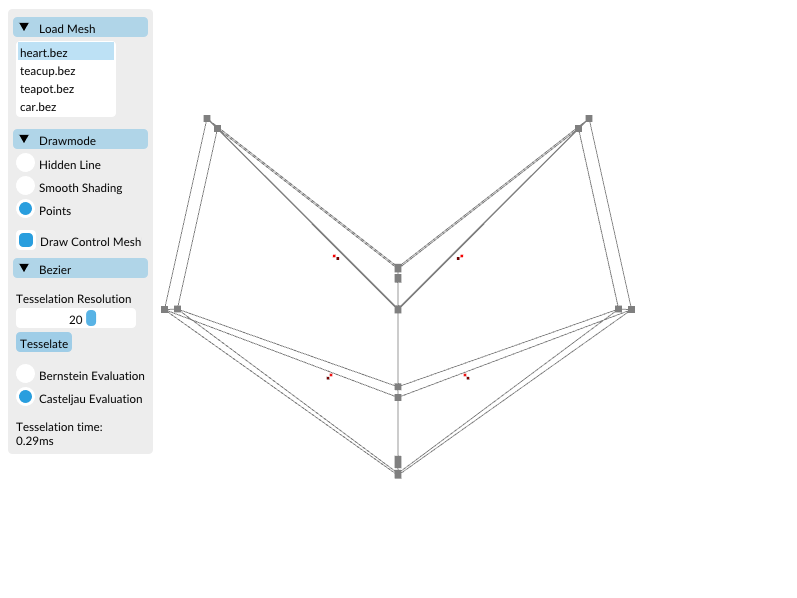
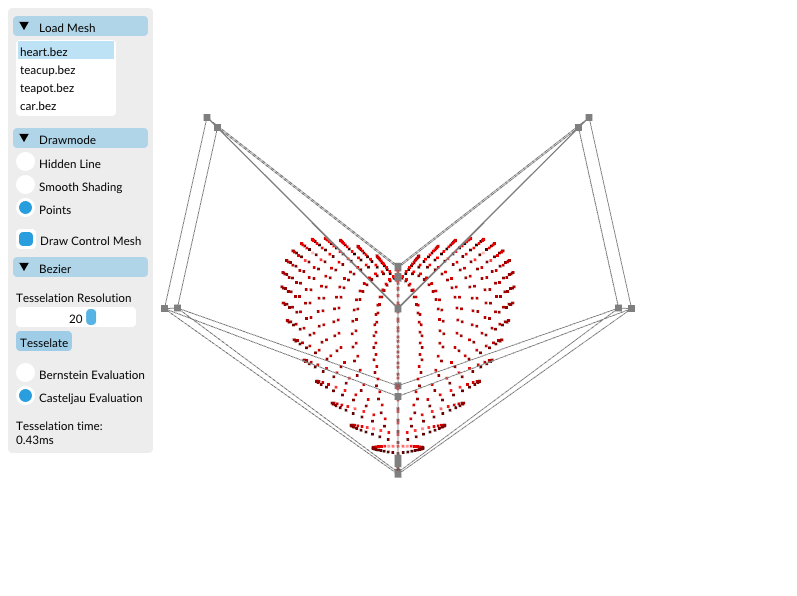
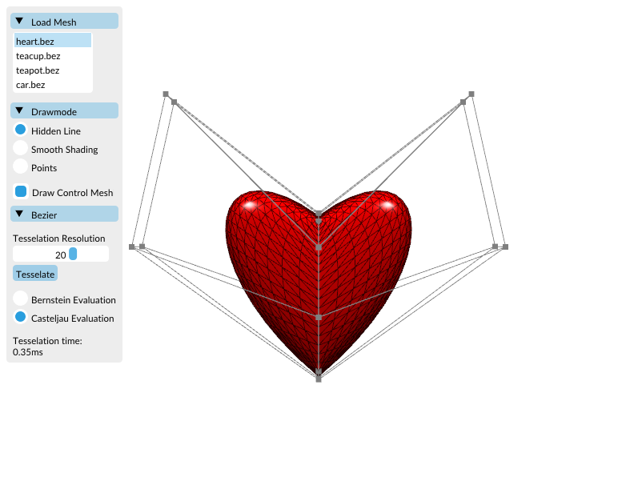
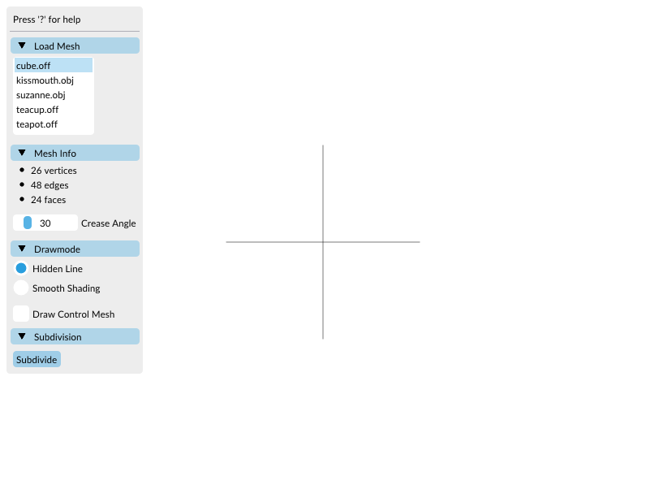
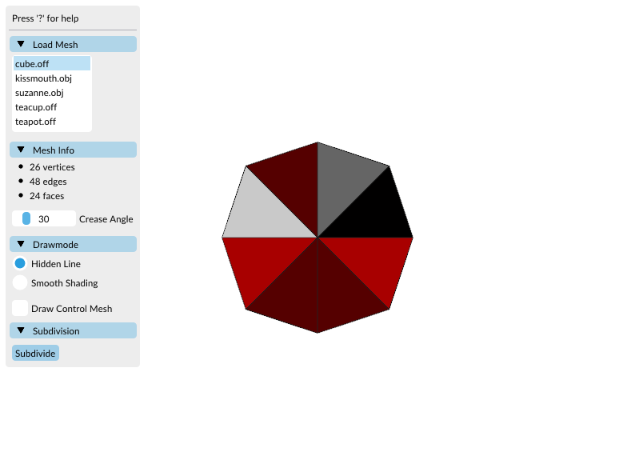
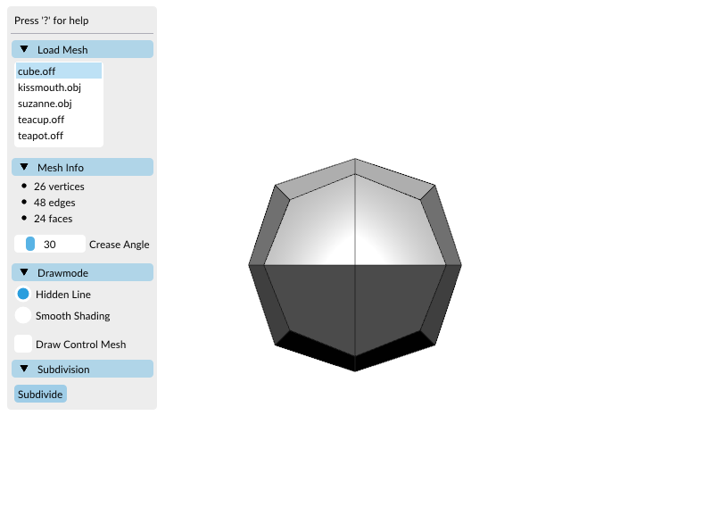
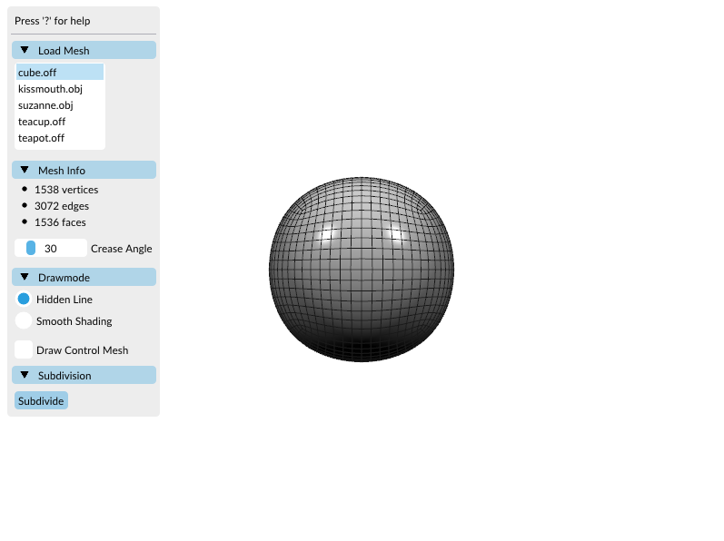

Bezier/Subdivision
==================

This package contains exercise code for the lecture "Computer Graphics" by Prof. Dr. Mario Botsch, TU Dortmund.

Documentation
-------------

A pre-built HTML documentation can be found in `doc/index.html` and can be opened via any web browser.

Prerequisites
-------------

We use [CMake](https://www.cmake.org) for setting up build environments. You can download it [here](https://cmake.org/download/) or by using your favourite package manager.
You will also need a C++ compiler. Depending on your OS, the typical choices are:

  * Linux - GCC/G++, usually pre-installed (terminal command: `sudo apt install build-essential`)
  * MacOS - Clang, comes with the IDE "XCode" (terminal command: `xcode-select --install`)
  * Windows - MSVC, can be installed alongside the IDE "Visual Studio Community" (see below) or separately [here](https://visualstudio.microsoft.com/downloads/#other) under "All Downloads" --> "Tools for Visual Studio" --> "Build Tools for Visual Studio 2019"

We highly recommend to use some kind of IDE. Prominent examples are:
 
 - [XCode](https://developer.apple.com/xcode/) (MacOS) 
 - [Visual Studio Community](https://visualstudio.microsoft.com/de/vs/community/) (Windows)
 - [Visual Studio Code](https://code.visualstudio.com/) (Linux, Windows, MacOS)
 - [Jetbrains CLion](https://www.jetbrains.com/de-de/clion/) (Linux, Windows, macOS)
 
Below, we provide examples for setting up, compiling and running the project via command line, XCode, VSCommunity and VSCode.

Building on Linux via Command Line (no IDE)
-------------------------------------------

Execute the following commands in the exercise's top-level directory:

    mkdir build
    cd build
    cmake ..
    make

The last command (`make`) compiles the application. Re-run it whenever you have added/changed code in order to re-compile.

For running the code via command line use either

    ./bezier
    
or

	./subdivision

Building on macOS (XCode)
--------------------------

Execute the following commands in the exercise's top-level directory:

    mkdir xcode
    cd xcode
    cmake -G Xcode ..

Open the generated .xcodeproj file. Inside XCode, select the bezier-executable or the subdivision-executable in the top bar next to the stop button. You can run the code by pressing the play button.
You can specify command line arguments by again opening the menu next to the stop button from the top bar and selecting "Edit Scheme". In the popup window, select the "Run" option left and open the "Arguments" tab.

Building on Windows (Visual Studio Community) 
---------------------------------------------

* In order to get the MSVC C++ compiler, make sure that you check "Desktop development with C++" during installation of [VSCommunity](https://visualstudio.microsoft.com/de/vs/community/)
* Create an empty build folder inside the project's top-level directory
* Start cmake-gui.exe (located in cmake's bin folder)
* Specify the top-level directory as source directory (button Browse source...)
* Specify the previously created build folder as build directory (button Browse build...)
* Select "Configure" using your Visual Studio Version as option.
* When configuration is finished, select "Generate".
* Start Visual Studio Community
* Open the project via File -> open -> project -> .sln in build folder
* In the project explorer window on the right, right-click the project (bezier or subdivision) and set it as startup-project
* Switch to release mode
* You can specify command line arguments via project -> properties -> debugging -> command arguments
* Hit CTRL + F5 to build and run (or CTRL + SHIFT + B to build)

Building via VSCode
-------------------

There are a lot of useful extensions for VSCode to shape it the way you like.
The required extensions for C++ development and Cmake support are "C/C++" and "Cmake Tools". Extensions can be found in the extensions tab on the left.
Once this is done, you can set up the project:

 * Start VSCode
 * Open the project via File --> Open Folder and select the exercise's top-level directory containing the `CMakeLists.txt` file and accept by clicking `OK`
 * In the bottom bar, click on `CMake`, choose your compiler and select `Release` mode
 * In the bottom bar, click on  `[all]` and select the right target (bezier or subdivision)
 * Still in the bottom bar, there are buttons for building (Build) and running (play symbol)
 * You can specify command line arguments by using the terminal inside of VSCode

Have a look at the VSCode [documentation](https://code.visualstudio.com/docs/cpp/introvideos-cpp) for further details. 

Command Line Arguments
----------------------

Running the executables without any arguments will load a default model and others can be loaded via the GUI. 
If you want to load a specific model on startup, you can provide the path to your model as a command line argument:

    ./bezier ../models/car.bez
    
Each IDE provides a different way, for specifying command line arguments. We give some examples above but refer to the IDEs' documentations for further details.

Navigation
----------

Use our GUI and the mouse/arrow keys to interact with the viewer.

Suggested order for the exercises
---------------------------------

It's up to you, which exercise part (Bezier/Subdivision) you do first. There are 3 different tasks: 

* **Bezier - point and normal calculation:**
  Compute position and normal of a bezier patch at parameter (u,v) in `Bezier_patch::position_normal(...)`. Both Bezier and de Casteljau algorithm should be implemented. The result should look like this:

* **Bezier - tesselation:**
  To obtain a triangle mesh from the bezier patches, complete the `tesselate(...)` method in `src/bezier_patch.cpp`. Use the simple `heart.bez` model for easier debugging. Adding points and normals will produce this result:

Tessellating them correctly:

After finishing this task, make sure that one of your evaluation algorithms is much faster than the other.

* **Subdivision:**
  For getting the subdivision to work, finish the method `subdivide()` in `src/subdivision/Mesh.cpp`. To do so, implement the generalized version of [Catmull-Clark](resources/CatmullClark.pdf). We use a special mesh format composed of halfedges, which makes it easier to find for example neighboring vertices or all vertices of a face. To get an overview of the most important features, we refer to our short [introduction](resources/SurfaceMeshIntro.pdf) or the online [pmp-tutorial](http://www.pmp-library.org/tutorial.html). Here some examples of the cube subdivision to compare your results:

